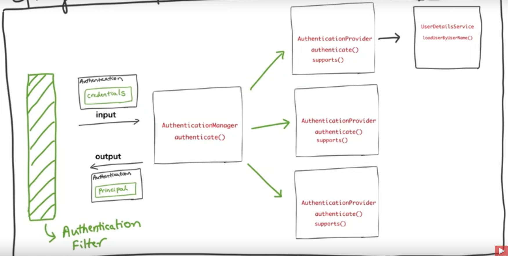

# SpringSecurity

## Dependency
- spring-boot-starter-security

## Annotations
- @EnableWebSecurity

## Spring Security Behaviour
- Adds mandatory authentication for URL
- Adds login form
  - username = user
  - password = provided in console
  - can configure in application.properties file
```xml
spring.security.user.name = name
spring.security.user.password = password
```

## Configuring the work done by AuthenticationManager
- The work done by the authentication manager is written in class called *WebSecurityConfigureAdapter* (present in SpringSecurityApp) which has method called *configure(AuthenticationMangaerBuilder)*
- Need to extend this class and override that method for customising the authentication
- look into second project for more details
```java
@EnableWebSecurity
public class AppSecurity extends WebSecurityConfigurerAdapter{
	
	// for Authentication purpose
	@Override
	protected void configure(AuthenticationManagerBuilder auth) throws Exception {
		auth.inMemoryAuthentication()
				.withUser("user")
				.password("user")
				.roles("USER")
				.and()
				.withUser("admin")
				.password("admin")
				.roles("ADMIN");
				
	}
	
	// for Authorization Purpose
	@Override
	protected void configure(HttpSecurity http) throws Exception {
		http.authorizeRequests()
			.antMatchers("/admin").hasRole("ADMIN")
			.antMatchers("/user").hasAnyRole("USER", "ADMIN")
			.antMatchers("/").permitAll().and().formLogin();
	}
	
	// for password encoding
	@Bean
	public PasswordEncoder getPasswordEncoder() {
		return NoOpPasswordEncoder.getInstance();
	}

}

```

## Authentication process

